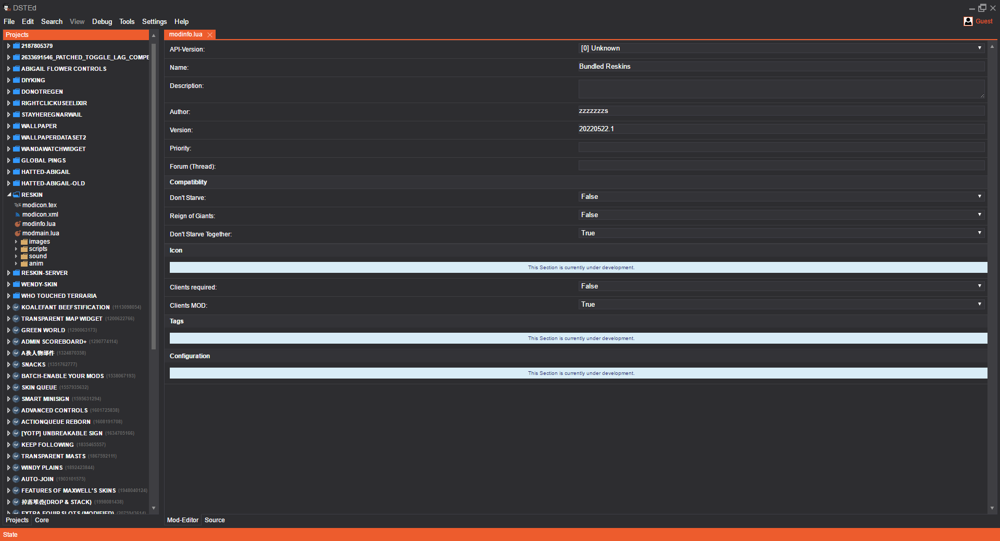

# 饥荒联机版mod制作工具等

本仓库主要包括查看饥荒源文件的一些程序。

[English readme here](readme_en.md)

## ktools

### BuildRenamer.exe

将一个build.bin的`build`替换成新名字，并删去build.bin尾部的符号表。

删去符号表不影响游戏。

### krane.exe与ktech.exe

原仓库：https://github.com/nsimplex/ktools

fork仓库：https://github.com/dstmodders/ktools

用法：

1. tex到png

```bash
ktech atlas-0.tex
ktech atlas-0.tex d:/
```

2. png到tex

```bash
ktech aaa.png
ktech d:/b/c.png e:/f/g/h.tex
```

3. 打印信息

```bash
ktech -i atlas-0.tex
```

4. anim.bin+build.bin+atlas-0.tex到scml文件

```bash
krane anim.bin build.bin output_dir
krane dirin dirout
krane ./ ./
```

推荐用法：两个参数都填动画文件所在文件夹名称

5. 特殊用法：用于修改原图，build.bin到边缘标记的png文件

```bash
krane --mark-atlases build.bin output_dir
```

6. 同时生成xml文件

```bash
ktech icon.png --atlas modicon.xml
```

会生成modicon,xml与modicon.tex

可能的错误：文件夹里有非英文字符报错。

## 例子：sample_build

里面是官方给的威尔逊scml工程文件。尝试将它打包成build.zip

## 例子：解压缩与转换

在Don't Starve Together\data\anim文件夹里找一个你喜欢的压缩包，先解压，然后用ktech查看图片，再用krane转换成scml文件。

**提示：你有可能发现缺少了什么东西，你可以在别的文件里找找**

## Spriter-4.2

较新版本的Spriter，你还可以在官网（需翻墙）下载未激活的Spriter Pro。个人评价不是很好用。

功能：播放动画、导出帧、导出gif动图、修改build名与bank名。

2013年的帖子：https://forums.kleientertainment.com/forums/topic/27247-new-asset-tools-animations-textures-sounds-and-layouts/

Klei的动画师使用Adobe Flash创作，不喜欢使用骨骼。他们自己建立了一个从Flash文件到饥荒动画文件的管道，其中包括一些压缩与微调。Flash支持斜切（skew），但Spriter不支持。Spriter以毫秒为单位计算帧，但Flash以帧为单位。饥荒的动画都是30fps，尽管我发现由autocompiler导出的动画是40fps；无论你在Spriter有多少关键帧，autocompiler都会以固定帧率计算。

Jan H.: Pretty much all of our characters and animation are done in Flash. We start by hand-drawing the character design (digitally using a Wacom Cintiq). Then we break up the characters into pieces (head, upper arms,  lower arms, legs, etc...) and use the symbol system in Flash to animate the pieces kind of like a cut-out animation.

可以使用`krane --check-animation-fidelity`命令查看动画文件是否包含Spriter不支持的变换。

关于人物动画有三只手等：游戏会隐藏其中一些物体，来使动画正确显示。这是一种很蠢的做法。Spriter不支持在查看时隐藏。

一张atlas最大的分辨率是2048x2048，所以你的图片的最大分辨率也是这样的。尽管你可以制作高分辨率的图片，但仍然建议不要太大，理由是占用的内存太多了。

## Spriter r11

最新版本的Spriter Pro。

激活码：

spriter@spk.stw           SPLK-BUIJ-0ZYY-NQ74

TheBlade@Pirates.gov      BLAD-C0P6-0T8D-K8XU

## textool v1.4.2.0

原仓库：https://github.com/zxcvbnm3057/dont-starve-tools

fork（本仓库使用该fork）：https://github.com/oblivioncth/dont-starve-tools

用于查看tex文件。

## (DontStarveLUAJIT)

由大佬制作的32位引擎补丁，在创意工坊有对应mod

原仓库：https://github.com/paintdream/DontStarveLuaJIT

也有64位的补丁。

https://github.com/fesily/DontStarveLuaJIT2

## steam的Don't Starve Mod Tools

这个工具包拥有上传到创意工坊的功能，还有一个autocompiler.exe

安装后，每次打开饥荒联机版，都会自动调用autocompiler.exe，把位于dont_starve\mods\xxx\的文件打包成另一种格式。

**注意：有些情况下这个工具生成的不是游戏里可用的动画文件，不知道为啥**

已知bug：

1. 来源：https://forums.kleientertainment.com/forums/topic/72067-autocompiler-symbol-issues/?tab=comments#comment-842755

Don't Starve Mod Tools/mod_tools/tools/scripts/buildanimation.py:163（现在已经不是这个行号了）

```python
layername = element_node.attributes["layername"].value.encode('ascii').split('/')[-1]
应该是
layername = element_node.attributes["name"].value.encode('ascii').split('/')[-1]
```

2. 不是循环的动画，消失的符号会重新出现（需要手动指定looping=false或者在Spriter里关闭循环）
3. 图片的可交互区域与实际不透明像素区域不同，游戏内选不中或者只能选中部分

## DS Tool

https://github.com/Jerry457/ds_tool

修复了一些autocompiler.exe的bug

## AnimBuilder

这个文件夹里包括两组程序。

第一组：enanim.py编译anim.xml，deanim.py反编译anim.bin。debuild.py反编译build.bin。使用mod tools自带的tools/scripts/buildanimation.py编译build.xml

第二组：animc.exe编译anim.xml与build.xml，animd.exe反编译anim.bin与build.bin

第一组程序来自@勿言（饥荒mod制作-五年一班）

第二组程序来自@Fa鸽 https://github.com/Akarinnnnn/KleiAnim

```bash
animc /anim anim.xml /build build.xml /out outdir
animd /in inputdir /out outputdir
```

```bash
py2 enanim.py
@py2指Don't Starve Mod Tools
```


## bmfont v.1.14a

字体制作软件

官方使用的版本是v1.12a。SHA256=6b675a96fba2e5b071323b60d7c476a80ea994888b4abd1b24485b8ce3e94614

http://www.angelcode.com/products/bmfont/

## DSTEd

仓库：https://github.com/DST-Tools/DSTEd

该程序提供了一个IDE，此链接为1.0版，有release；更新的2021年的2.0版没有release，需要自己编译。我编译了一下，各种报错，用不了。



## FsbExtractor14.03.10

fsb格式音频查看与提取软件

## FMOD FSB Extractor

命令行fsb格式音频提取为wav格式软件

## TexExplorer

仓库地址：https://github.com/tpxxn/TexExplorer

与TexTool相比，提供了更加方便的图集信息查看功能，但更加简陋。

## notes

青木的笔记

## ztools

仓库地址：https://gitlab.com/Zarklord/ztools

ztools.exe与ktech.exe类似。支持多图片打包成一个tex

需要安装[ImageMagick](https://imagemagick.org/index.php)

## Texture And Atlas Packer

文件地址：https://forums.kleientertainment.com/files/file/1333-texture-and-atlas-packer/

多图片打包成一个tex

## STex

仓库地址：https://github.com/oblivioncth/Stexatlaser

多图片打包成一个tex

```bash
stex pack -i inputdir -o outputdir
```

tex分解成多图片

```bash
stex unpack -i input.xml -o outputdir
```

经过检测，stex是唯一一个正确处理透明图片的程序，因此建议不要使用`ktech`或者`ztools`

## Don't Starve Speech File Editor v0.8

语言文件编辑器

https://forums.kleientertainment.com/forums/topic/146612-tool-dont-starve-speech-file-editor-or-comparer-however-you-want-to-call-it/#comment-1626634

# Tiled

【不包括】

https://www.mapeditor.org/

地图编辑器

# steamdown

markdown转steam

# steam2md.py

steam转markdown

# pyscripts

[中文](pyscripts/readme_zh.md)

[English](pyscripts/readme.md)

# html

## index.html

​		要么开启CORS，要么下载到本地打开

http://htmlpreview.github.io/?https://github.com/ZzzzzzzSkyward/DSTmodutils/blob/master/html/index.html

动画播放器。

打开build.json和anim.json以播放动画

点击标题以阅读详细说明

## 资料来源

https://forums.kleientertainment.com/files/category/5-modding-tools-tutorials-examples/

github, gitlab

